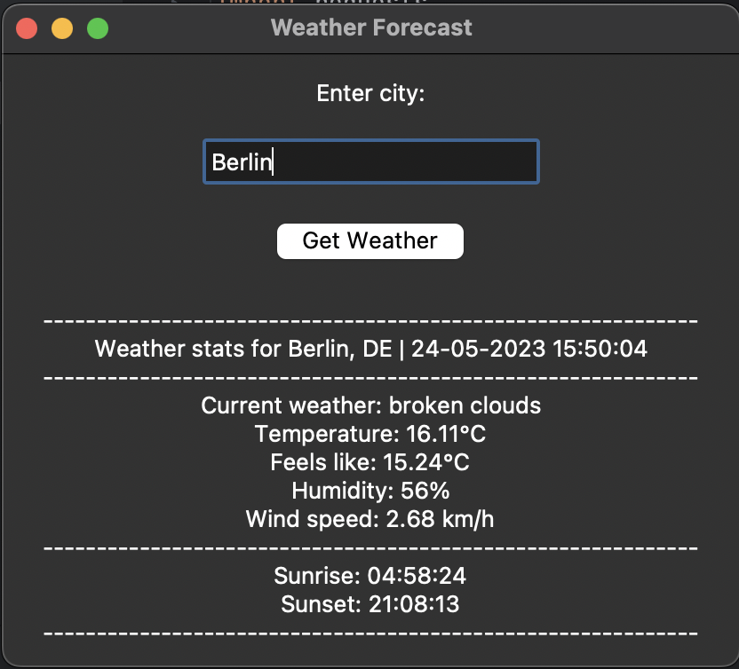

# Wetter-App Tkinter



Einfache Wetter-App, die die [OpenWeatherMap API](https://openweathermap.org/api) verwendet, um das Wetter für eine bestimmte Stadt zu ermitteln.

## Beschreibung

Diese App wurde erstellt, um den Umgang mit der [OpenWeatherMap API](https://openweathermap.org/api) zu erlernen und um API-Aufrufe mit Python zu üben. Die Anwendung verwendet die Bibliothek [requests](https://requests.readthedocs.io/en/master/), um die API-Aufrufe zu tätigen, und die Bibliothek [Tkinter](https://tkdocs.com/), um die grafische Benutzeroberfläche zu erstellen.

## Erste Schritte

### API-Schlüssel

Besuchen Sie die [OpenWeatherMap API](https://openweathermap.org/api) Website, um einen API-Schlüssel zu erhalten. Sobald Sie einen API-Schlüssel haben, erstellen Sie eine Datei namens `api_key.txt` im Hauptverzeichnis des Projekts und fügen Sie die folgende Zeile in die Datei ein:

```python
API_KEY
```

### Abhängigkeiten

* Python 3.8.5
* requests 2.25.1
* Tkinter 8.6

### Installieren

* Klonen des Repositorys
* Installieren Sie die Abhängigkeiten
* Fügen Sie Ihren API-Schlüssel in die Datei `api_key.txt` ein.
* Starten Sie die Datei `main.py` oder `website.py`.
* Viel Spaß!