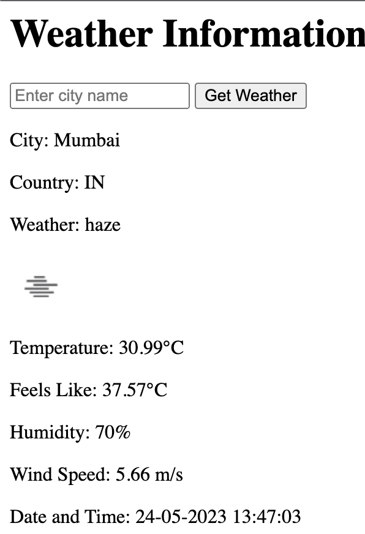

# Django Website für Wettervorhersage

## Beschreibung

Dies ist eine Django-Website, die die OpenWeatherMap API verwendet, um die Wettervorhersage für eine bestimmte Stadt anzuzeigen. Die Website zeigt auch das aktuelle Datum und die Uhrzeit für die angegebene Stadt an.

Hinweis: Der Code ist derselbe wie der Code in der `weather.py`.

## Lokal testen

1. Klone das Repository
2. Installiere die Dependencies
3. Fügen Sie Ihren API-Schlüssel in die Datei `weather/views.py` ein
4. Führen Sie die Datei `manage.py` mit `python manage.py runserver` aus